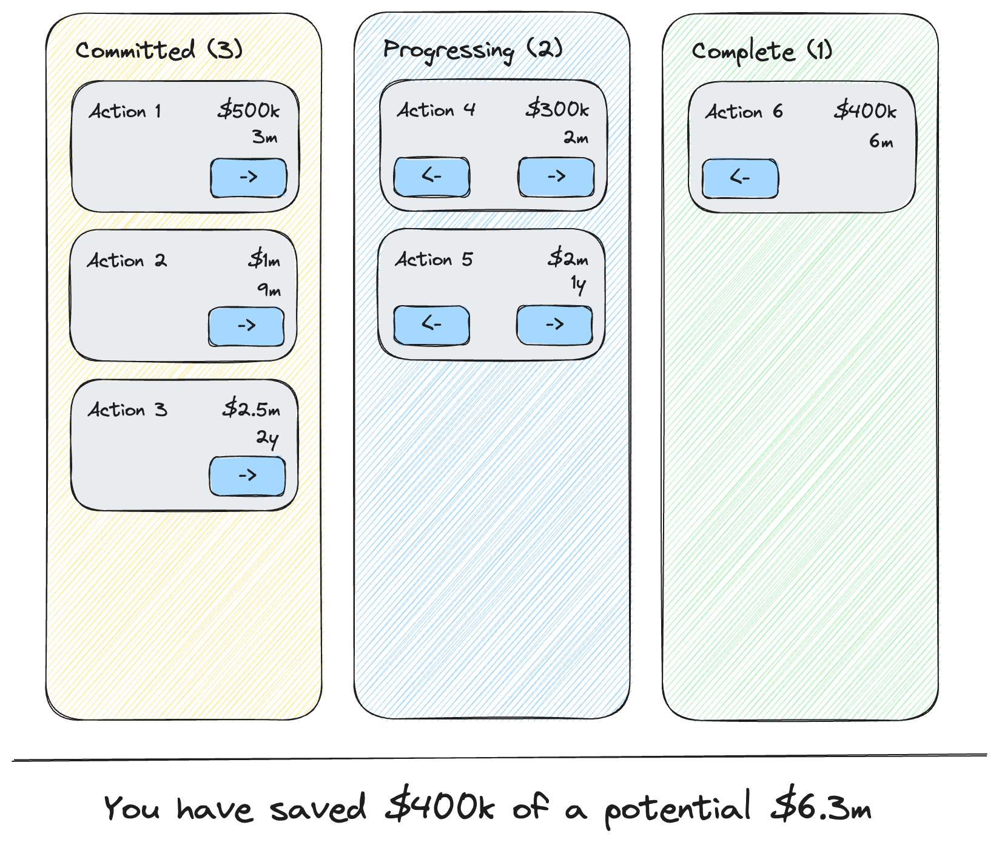

# M2030 Frontend Interview project

## The exercise

In this scenario, one of your team members has started work on implementing a page which shows the progress of a customer's selected actions and what stage they are at. The person who started work ran out of time before going on holiday and has handed over the task to you and another team mate.

You need to work together to decide how to finish this piece of work and follow-up on your colleagues TODO notes that they left.

### Requirements from product

#### Design

The design team have provided this design for how the page should appear.

Your colleague has already completed this aspect -- you don't need to worrying about any visual aspects unless you wish to make some suggestions on the CSS code!



#### Acceptance tests

The product team have provided the following acceptance tests:

1. The actions are displayed in the appropriate status (pending, in progress, complete)
1. There is a count of the number of actions in the column
1. A "pending" action can be moved to "in progress" via the next (right arrow) button
1. An "in progress" action can be moved back to "pending" via the previous (left arrow) button
1. An "in progress" action can be moved to "complete" via the next (right arrow) button
1. A "complete" action can be moved back to "in progress" via the previous (left arrow) button
1. A summary of the savings is dismayed showing the proportion of the sum of completed cost savings relative to the committed cost-savings
1. Each action card displays the title of the action
1. Each action card displays the cost saving of that action using the following rules:
   - Values up to 1,000 should display as US$ _number_
   - Values between 1,000 and less than 1,000,000 should display as US$ *thousands*k with 3 significant figures displayed
   - Values from 1,000,000 upwards should display as US$ *millions*m with 3 significant figures displayed
1. Each action card displays the payback period of the action using the following rules:
   - Values less than 1 year (12 months) should display as *months*m (e.g. 10m for 10 months)
   - Values greater than 1 year should display in the form *x*y, *y*m where _x_ is the number of years and _y_ the number of months, e.g. an 18 month payback period should be displayed as _1y, 6m_.
   - For any whole year payback periods, these should display simply as \_x*y, e.g. a 12 month payback should appear as \_1y* and a 24 month payback should appear as _2y_.

### Handover from your colleague

> I've implemented most of the functionality and it should be working for the most part. However, I didn't get round to implementing the summary of the cost savings -- I created a component and pasted in the text from the design file, but didn't get round to wiring this up.

> I've made a list of TODOs that I would liked to have spent more time on that it would be useful for you to look over

#### Unfinished items

_You can search the codebase for the numbered `TODO n` item to find the code referred to_

1. [ ] Implement summary component + tests (all the data is in the store already) `TODO 1`
1. [ ] Fix the code around the payback period. The test is correct, but failing `TODO 2`
1. [ ] Please could you provide feedback on how I implemented the cost saving tests. I'm not that happy with them yet `TODO 3`
1. [ ] Review the code in the action-items-stages component (both TypeScript and HTML) to see whether this could be simplified `TODO 4`
1. [ ] Re-work the loading of the actions to use an API client (discuss an approach from a high-level - no actual implementation required) `TODO 5`

## How to work with the code

### Start the app

To start the development server run `nx serve frontend-interview`. Open your browser and navigate to http://localhost:4200/. Happy coding!

### Running tests

Test can be run via Jest. There's a handy shortcut in:

```bash
$ npm test
```

### Generate code

If you happen to use Nx plugins, you can leverage code generators that might come with it.

Run `nx list` to get a list of available plugins and whether they have generators. Then run `nx list <plugin-name>` to see what generators are available.

Learn more about [Nx generators on the docs](https://nx.dev/plugin-features/use-code-generators).
