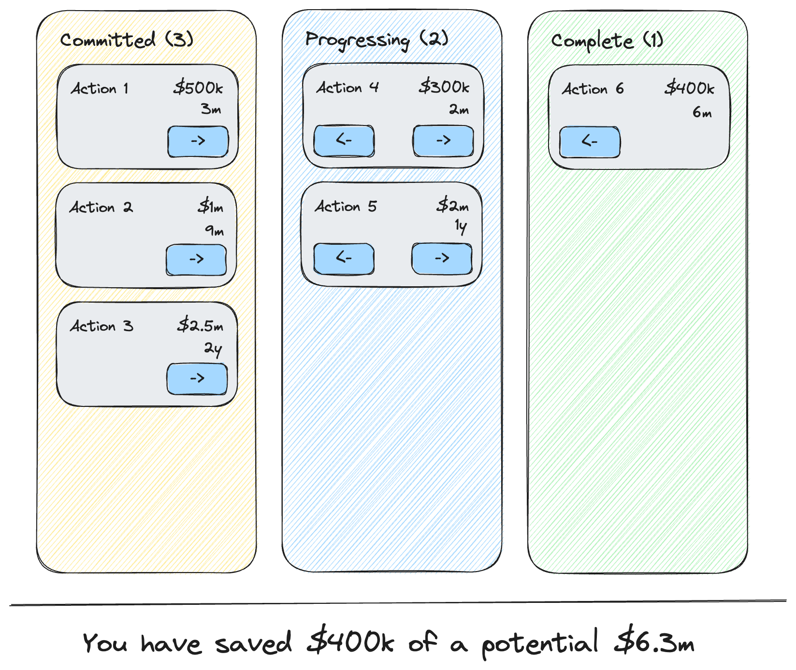

# Requirements from product

## Design

The design team have provided this design for how the page should appear.

Your colleague has already completed this aspect -- you don't need to worrying about any visual aspects unless you wish to make some suggestions on the CSS code!

## Acceptance tests

The product team have provided the following acceptance tests:

1. The actions are displayed in the appropriate status (pending, in progress, complete)
1. There is a count of the number of actions in the column
1. A "pending" action can be moved to "in progress" via the next (right arrow) button
1. An "in progress" action can be moved back to "pending" via the previous (left arrow) button
1. An "in progress" action can be moved to "complete" via the next (right arrow) button
1. A "complete" action can be moved back to "in progress" via the previous (left arrow) button
1. A summary of the savings is displayed showing the proportion of the sum of completed cost savings relative to the total potential savings
1. Each action card displays the title of the action
1. Each action card displays the cost saving of that action using the following rules:
   - Values up to 1,000 should display as US$ _number_
   - Values between 1,000 and less than 1,000,000 should display as US$ *thousands*k with 3 significant figures displayed
   - Values from 1,000,000 upwards should display as US$ *millions*m with 3 significant figures displayed
1. Each action card displays the payback period of the action using the following rules:
   - Values less than 1 year (12 months) should display as *months*m (e.g. 10m for 10 months)
   - Values greater than 1 year should display in the form *x*y, *y*m where _x_ is the number of years and _y_ the number of months, e.g. an 18 month payback period should be displayed as _1y, 6m_.
   - For any whole year payback periods, these should display simply as \_x*y, e.g. a 12 month payback should appear as \_1y* and a 24 month payback should appear as _2y_.
